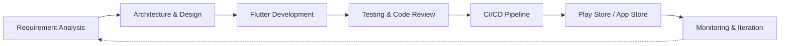

<!-- ============================================================ -->
<!--                          HEADER                              -->
<!-- ============================================================ -->

  

# Hi, I'm Fazle Rabbi 👋

### Senior Flutter Developer | Mobile Application Engineer

 

  

**[About](#about-me)** &nbsp;•&nbsp; **[Snapshot](#professional-snapshot)** &nbsp;•&nbsp; **[Workflow](#engineering-workflow)** &nbsp;•&nbsp; **[Expertise](#technical-expertise)** &nbsp;•&nbsp; **[Tools](#languages--tools)** &nbsp;•&nbsp; **[Strengths](#core-strengths)** &nbsp;•&nbsp; **[Stats](#github-statistics)** &nbsp;•&nbsp; **[Focus](#current-focus)** &nbsp;•&nbsp; **[Connect](#connect-with-me)**

---

## Professional Summary

I am a passionate **Flutter Developer with 3+ years of experience** building scalable, high-performance, and user-focused mobile applications for Android and iOS.

I specialize in developing production-ready applications using **Flutter, Dart, modern architectural patterns, state management solutions, RESTful APIs, Firebase, third-party SDKs, and clean coding practices**.

I am committed to continuous learning, writing maintainable code, improving application performance, and delivering high-quality digital products.

---

## Professional Snapshot

| | |
|:--|:--|
| **Role** | Senior Flutter Developer &#124; Mobile Application Engineer |
| **Experience** | 3+ years of professional Flutter development |
| **Platforms** | Android and iOS |
| **Core Stack** | Flutter · Dart · Firebase · REST APIs |
| **Architecture** | Clean Architecture · MVVM · Feature-based structure |
| **State Management** | BLoC / Cubit · Riverpod · GetX · Provider |
| **Delivery** | Google Play Store · Apple App Store · CI/CD |
| **Ways of Working** | Agile / Scrum · Code reviews · Mentoring |

---

## Connect With Me

  
  
  

---

## About Me

- 📱 Developing cross-platform mobile applications with Flutter
- 🏗️ Applying Clean Architecture, MVVM, and scalable project structures
- ⚡ Building responsive, accessible, and high-performance user interfaces
- 🔌 Integrating RESTful APIs, Firebase, payment gateways, maps, and third-party SDKs
- 🧪 Writing testable and maintainable code using modern testing practices
- 🚀 Managing application deployment to Google Play Store and Apple App Store
- 🤝 Collaborating with teams through Agile development, code reviews, and technical discussions
- 📚 Continuously learning modern tools, technologies, and best practices

---

## Engineering Workflow

---

## Technical Expertise

<table>
  <tr>
    <td width="50%" valign="top">

### Mobile Application Development

- Flutter and Dart
- Android and iOS application development
- Responsive and adaptive UI design
- Material Design and Cupertino widgets
- Custom UI components and animations
- Accessibility and localization
- Deep linking and universal links
- Push notifications
- Google Maps integration
- Video calling SDK integration
- AdMob integration
- Payment gateway integration
- App Store and Google Play Store deployment

</td>
    <td width="50%" valign="top">

### Architecture and State Management

- Clean Architecture
- MVVM and MVC
- Feature-based project structure
- Repository pattern
- Dependency injection
- BLoC and Cubit
- Riverpod
- GetX
- Provider
- SOLID principles
- Design patterns
- Separation of concerns

</td>
  </tr>
  <tr>
    <td width="50%" valign="top">

### Modern Flutter Development

- Dart null safety
- Dart 3 features
- Flutter performance optimization
- Flutter DevTools
- Widget lifecycle management
- Isolates and background processing
- Streams and asynchronous programming
- Form validation and complex user flows
- Offline-first application development
- Pagination and infinite scrolling
- Caching and retry mechanisms
- Error handling and logging
- Environment configuration and build flavors
- Reusable design systems and component libraries

</td>
    <td width="50%" valign="top">

### API and Backend Integration

- RESTful API integration
- JSON serialization and deserialization
- Dio and HTTP clients
- API authentication and token management
- Interceptors and request handling
- Multipart file upload
- WebSockets and real-time communication
- GraphQL fundamentals
- Firebase Authentication
- Cloud Firestore
- Firebase Storage
- Firebase Cloud Messaging
- Firebase Crashlytics
- Firebase Analytics
- Firebase Remote Config

</td>
  </tr>
  <tr>
    <td width="50%" valign="top">

### Local Database and Storage

- SQLite and SQFLite
- Hive
- Isar
- SharedPreferences
- Secure Storage
- Offline data synchronization
- Local caching strategies

</td>
    <td width="50%" valign="top">

### Testing and Quality Assurance

- Unit testing
- Widget testing
- Integration testing
- BLoC and state-management testing
- Mocking and test-driven development fundamentals
- Code quality analysis
- Debugging and performance profiling
- Crash monitoring and issue tracking

</td>
  </tr>
  <tr>
    <td width="50%" valign="top">

### DevOps and Release Management

- Git and GitHub
- GitHub Actions
- CI/CD pipelines
- Fastlane fundamentals
- Android signing and release configuration
- iOS certificates and provisioning profiles
- Google Play Console
- App Store Connect
- Staging and production environments
- Semantic versioning
- Release management

</td>
    <td width="50%" valign="top">

### Collaboration and Leadership

- Agile and Scrum methodologies
- Jira and task management
- Technical documentation
- Code review and mentoring
- Team collaboration
- Requirement analysis
- Problem solving
- Technical leadership

</td>
  </tr>
</table>

---

## Languages & Tools

<table align="center">
  <tr>
    <td><strong>Languages</strong></td>
    <td>
      
    </td>
  </tr>
  <tr>
    <td><strong>Frameworks</strong></td>
    <td>
      
    </td>
  </tr>
  <tr>
    <td><strong>Backend & Cloud</strong></td>
    <td>
      
    </td>
  </tr>
  <tr>
    <td><strong>Databases</strong></td>
    <td>
      <strong>SQFLite · Hive · Isar · Firestore · SharedPreferences · Secure Storage</strong>
    </td>
  </tr>
  <tr>
    <td><strong>State Management</strong></td>
    <td>
      <strong>BLoC · Cubit · Riverpod · GetX · Provider</strong>
    </td>
  </tr>
  <tr>
    <td><strong>Development Tools</strong></td>
    <td>
      
    </td>
  </tr>
  <tr>
    <td><strong>DevOps & CI/CD</strong></td>
    <td>
      <strong>GitHub Actions · Fastlane · Firebase App Distribution · Play Console · App Store Connect</strong>
    </td>
  </tr>
  <tr>
    <td><strong>Testing & Quality</strong></td>
    <td>
      <strong>Unit Testing · Widget Testing · Integration Testing · Flutter DevTools · Firebase Crashlytics</strong>
    </td>
  </tr>
  <tr>
    <td><strong>Project Management</strong></td>
    <td>
      <strong>Agile · Scrum · Jira</strong>
    </td>
  </tr>
</table>

---

## Core Strengths

<table align="center">
  <tr>
    <td>📱 Cross-Platform Mobile Development</td>
    <td>🏛️ Clean and Scalable Architecture</td>
  </tr>
  <tr>
    <td>⚡ Performance Optimization</td>
    <td>🧪 Testing and Code Quality</td>
  </tr>
  <tr>
    <td>🔌 API and Firebase Integration</td>
    <td>🔐 Secure Authentication and Data Handling</td>
  </tr>
  <tr>
    <td>🚀 CI/CD and Production Deployment</td>
    <td>🎨 Responsive and Accessible UI</td>
  </tr>
  <tr>
    <td>🤝 Agile Collaboration</td>
    <td>👨‍💻 Technical Leadership and Mentoring</td>
  </tr>
</table>

---

## GitHub Statistics

  

  
  

---

## Current Focus

- Building scalable and maintainable Flutter applications
- Improving app performance and user experience
- Implementing automated testing and CI/CD workflows
- Exploring advanced Flutter, Dart, and backend technologies
- Contributing to collaborative and open-source projects

---

  <strong>Thanks for visiting my profile!</strong>
   
  Feel free to connect with me or explore my repositories.

